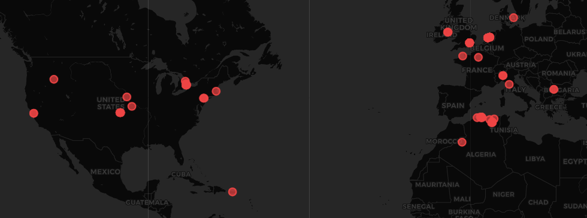

# Python SIEM -- Real-Time Intrusion Detection System

A Security Information and Event Management (SIEM) system built in Python. This project provides real-time network traffic monitoring, multi-engine threat detection (RegEx signatures + Artificial Intelligence), full log encryption, and a modern graphical dashboard with a worldwide threat map.

---

## Table of Contents

1. [General Architecture](#general-architecture)
2. [Key Features](#key-features)
3. [Project Structure](#project-structure)
4. [Prerequisites and Installation](#prerequisites-and-installation)
5. [Configuration](#configuration)
6. [Usage](#usage)
7. [Detection Engines](#detection-engines)
8. [Machine Learning](#machine-learning)
9. [Log Encryption](#log-encryption)
10. [Geolocation](#geolocation)
11. [Database](#database)
12. [Attack Generator](#attack-generator)
13. [Technology Stack](#technology-stack)

---

## General Architecture

```
Network Logs (encrypted)
        |
        v
  +---------------------+
  |   Decryption         |   utils/dechiffrer.py (Fernet AES-128-CBC)
  +---------------------+
        |
        v
  +---------------------+       +---------------------+
  |  11 RegEx Detectors  | ----> |   Alert Manager     |
  |  (detectors/)        |       |   (core/)           |
  +---------------------+       +---------------------+
        |                               |
        v                               v
  +---------------------+       +---------------------+
  |  ML Model            |       |   Database          |
  |  Isolation Forest    |       |   SQLite (siem.db)  |
  +---------------------+       +---------------------+
        |                               |
        +---------------+---------------+
                        |
                        v
              +---------------------+
              |   Dashboard GUI     |
              |   PySide6 + Folium  |
              +---------------------+
```

---

## Key Features

- **Hybrid detection**: combination of 11 signature-based detectors (RegEx) and a Machine Learning model (Isolation Forest) to identify both known and unknown threats.
- **Full encryption**: all logs are encrypted with AES via Fernet (cryptography library) before being written to disk. Decryption is performed on the fly during analysis.
- **Geolocation**: source IP addresses are located using the MaxMind GeoLite2-City database (country, city, GPS coordinates), with reputation checks via the AbuseIPDB API.
- **Modern GUI**: real-time dashboard with statistics cards, alert table, Top 5 countries chart, Top 10 IPs list, and an interactive world map (Folium + CartoDB dark_matter).
- **Persistence**: all alerts are stored in a SQLite database with severity level, ML score, geographic data, and timestamps.
- **Built-in attack generator**: simulates malicious traffic (signature-based and behavioral) for demonstrations and testing.

---

## Project Structure

```
Python-SIEM/
|
|-- dashboard_gui.py          # Main entry point (Graphical Interface)
|-- attacks_generator.py      # Malicious traffic generator for testing
|-- geo_finder.py             # Geolocation module (GeoLite2-City)
|-- requirements.txt          # Python dependencies
|-- .env                      # Environment variables (keys, paths)
|-- chiffred.enc              # Encrypted log file (generated at runtime)
|-- siem.db                   # SQLite database (generated at runtime)
|
|-- config/
|   |-- settings.py           # Configuration loader (.env)
|
|-- core/
|   |-- alert_manager.py      # Alert manager (severity, geo, DB)
|   |-- database.py           # SQLite data access layer
|
|-- detectors/                # 11 signature-based detection engines
|   |-- sqli.py               # SQL Injection
|   |-- xss.py                # Cross-Site Scripting (XSS)
|   |-- bruteforce.py         # Brute Force
|   |-- csrf.py               # Cross-Site Request Forgery (CSRF)
|   |-- crlf.py               # CRLF Injection
|   |-- nosql.py              # NoSQL Injection
|   |-- os_injection.py       # OS Command Injection
|   |-- traversal.py          # Path Traversal
|   |-- file_upload.py        # Malicious File Upload
|   |-- HTTP.py               # HTTP Scanner Detection
|   |-- ip.py                 # IP Reputation (AbuseIPDB)
|
|-- ml/                       # Machine Learning module (see ml/README.md)
|   |-- anomaly_detector.py   # Anomaly detector (Isolation Forest)
|   |-- train.py              # Training script
|   |-- anomaly_model.pkl     # Serialized model (pre-trained)
|   |-- scaler.pkl            # Serialized scaler (StandardScaler)
|
|-- utils/
|   |-- chiffrer.py           # Fernet encryption (AES)
|   |-- dechiffrer.py         # Fernet decryption
|   |-- normalize.py          # Log normalization
|
|-- data/
|   |-- GeoLite2-City.mmdb    # MaxMind geolocation database
|
|-- logs/
    |-- alerts.log            # Alert log file (plain text)
```

---

## Prerequisites and Installation

### Prerequisites

- Python 3.10 or higher
- pip (Python package manager)
- GeoLite2-City database (`.mmdb` file placed in `data/`)

### Installation

```bash
# 1. Clone the repository
git clone <repository-url>
cd Python-SIEM

# 2. Create a virtual environment (recommended)
python -m venv venv
venv\Scripts\activate    # Windows
source venv/bin/activate # Linux / macOS

# 3. Install dependencies
pip install -r requirements.txt

# 4. Configure environment variables
# Edit the .env file (see Configuration section)

# 5. Launch the dashboard
python dashboard_gui.py
```

The ML model ships **pre-trained** (`ml/anomaly_model.pkl`). The dashboard automatically loads it at startup. If you wish to retrain the model with fresh data, run `python ml/train.py` manually.

---

## Configuration

The `.env` file at the project root contains the following variables:

| Variable         | Description                                        | Required |
|------------------|----------------------------------------------------|:--------:|
| `FERNET_KEY`     | Fernet encryption key (base64, 32 bytes)           | Yes      |
| `CHIFFRED_PATH`  | Path to the encrypted log file                     | No       |
| `API_KEY`        | AbuseIPDB API key for IP reputation                | Yes      |

To generate a Fernet key:

```python
from cryptography.fernet import Fernet
print(Fernet.generate_key().decode())
```

---

## Usage

### Launch the Dashboard

```bash
python dashboard_gui.py
```

The interface starts and automatically monitors the `chiffred.enc` file. Each new encrypted line is decrypted, analyzed by all 11 detectors and the ML model, then displayed in real time.

### Start the Attack Generator

From the dashboard, click the **Start** button in the control bar. The generator simulates a variety of attacks (SQL Injection, XSS, Brute Force, CSRF, behavioral anomalies, etc.) and writes the encrypted logs to `chiffred.enc`.

### Filter Alerts

The **Filter** dropdown menu allows selecting a specific attack type to display only matching alerts.

---

## Detection Engines

The `detectors/` directory contains 11 independent detection engines, each specialized in a specific threat type:

| Detector           | File               | Detection Method                                                  |
|--------------------|--------------------|-------------------------------------------------------------------|
| SQL Injection      | `sqli.py`          | 40+ RegEx patterns (UNION, DROP, stacked queries, etc.)           |
| XSS                | `xss.py`           | HTML/JavaScript patterns (script, onerror, onload, etc.)          |
| Brute Force        | `bruteforce.py`    | Frequency analysis of failed login attempts                       |
| CSRF               | `csrf.py`          | Missing CSRF token or suspicious referer detection                |
| CRLF Injection     | `crlf.py`          | %0d%0a sequences and carriage returns in headers                  |
| NoSQL Injection    | `nosql.py`         | MongoDB operators ($gt, $ne, $where, $regex)                      |
| OS Command Inject. | `os_injection.py`  | System commands (whoami, cat, ls, pipes, backticks)               |
| Path Traversal     | `traversal.py`     | ../ sequences and sensitive file access                           |
| File Upload        | `file_upload.py`   | Dangerous extensions (.php, .exe, .jsp, double extensions)        |
| HTTP Scanner       | `HTTP.py`          | Scanning tool User-Agents (sqlmap, Nikto, Nmap, DirBuster)       |
| IP Reputation      | `ip.py`            | AbuseIPDB API with cache (configurable confidence threshold)      |

Each detector exposes a `detect(line)` function that returns a tuple `(found: bool, patterns: list, attack_type: str)`.

---

## Machine Learning

The `ml/` module integrates an anomaly detector based on the **Isolation Forest** algorithm from scikit-learn. This complementary engine is capable of detecting unknown or obfuscated attacks that bypass RegEx signatures.

The model extracts 13 features from each HTTP request (length, Shannon entropy, special character ratio, known pattern matches, etc.) and assigns an anomaly score between 0 and 1.

The model is **pre-trained and shipped with the project**. The dashboard loads it automatically at startup -- no manual training step is required.

For more details on the ML architecture, training pipeline, and performance metrics, see the dedicated documentation: [ml/README.md](ml/README.md).

---

## Log Encryption

All logs are encrypted using the **Fernet** algorithm (AES-128-CBC + HMAC-SHA256) from the `cryptography` library.

- **Encryption** (`utils/chiffrer.py`): each log line is individually encrypted and appended to the `chiffred.enc` file.
- **Decryption** (`utils/dechiffrer.py`): the dashboard decrypts each line on the fly for analysis and display.
- **Key**: stored in the `.env` file under the `FERNET_KEY` variable.

This mechanism ensures the confidentiality of logs stored on disk, even in the event of a file system compromise.

---

## Geolocation

Source IP geolocation relies on two components:

1. **GeoLite2-City** (MaxMind): local database (`data/GeoLite2-City.mmdb`) providing the country, city, and GPS coordinates for each IP. A slight jitter is applied to coordinates to prevent visual stacking on the map.

2. **AbuseIPDB** (API): external IP reputation service. The confidence score (0-100%) is compared against a configurable threshold (default: 50%). A one-hour local cache prevents redundant API calls.

---

## Database

The `siem.db` file (SQLite) is automatically generated on first launch. It contains:

- **alerts table**: timestamp, attack type, detected pattern, source IP, severity (critical/high/medium/low), ML score, geographic data (country, city, coordinates), raw log line.
- **honeypot_logs table**: service, source IP, port, attempted credentials, executed commands.

The `Database` class (`core/database.py`) provides methods for insertion, querying (recent alerts, top attackers, timeline, geo data), and maintenance (purging data older than 30 days).

---

## Attack Generator

The `attacks_generator.py` file simulates realistic network traffic including:

- **Signature-based attacks**: payloads detectable by RegEx (SQL Injection, XSS, CSRF, CRLF, Path Traversal, NoSQL Injection, OS Command Injection, HTTP Scanner, File Upload).
- **Behavioral attacks**: obfuscated payloads designed to bypass RegEx and only be detected by the ML model (high entropy, non-standard encodings, massive payloads, prototype pollution).
- **Normal traffic**: legitimate HTTP requests to maintain a realistic ratio.

The distribution across these three categories is balanced (33% each).

---

## Technology Stack

| Component               | Technology                         |
|-------------------------|------------------------------------|
| Language                | Python 3.10+                       |
| Graphical Interface     | PySide6 (Qt6)                      |
| Mapping                 | Folium + CartoDB dark_matter       |
| Machine Learning        | scikit-learn (Isolation Forest)    |
| Encryption              | cryptography (Fernet / AES)        |
| Geolocation             | geoip2 (MaxMind GeoLite2-City)     |
| IP Reputation           | AbuseIPDB (REST API)               |
| Database                | SQLite3                            |
| Configuration           | python-dotenv                      |

---

## License

Academic project. All rights reserved.
